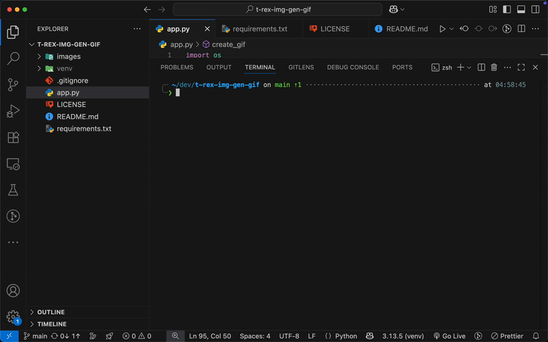

# T-Rex Animation Generator



This is a command-line tool to convert a sequence of images into animated GIFs and MP4 videos at various frame rates. It's designed to be simple and interactive, allowing you to generate multiple animation formats from a single set of source images.

## Features

-   **Interactive CLI**: Guides you through setting animation duration and frame rates.
-   **Multiple Outputs**: Generates both infinitely-looping GIFs and fixed-duration MP4 videos.
-   **Batch Processing**: Creates animations for multiple FPS options (e.g., 2, 3, 5 FPS) in one run.
-   **Automatic Resizing**: Ensures all frames in the animation are a consistent size based on the first image.
-   **Output Management**: Prompts to either archive or delete previous outputs before generating new files.
-   **Modern & Readable Code**: Utilizes modern Python practices, including type hints, for a clean and maintainable codebase.

## Prerequisites

-   Python 3.x
-   `pip` for installing packages

## Setup

1.  **Clone the repository:**
    ```sh
    git clone https://github.com/qpedrick/image-to-mp4-and-gif.git
    cd t-rex-img-gen-gif
    ```

2.  **Create and activate a virtual environment:**
    ```sh
    # Create venv
    python -m venv venv

    # Activate on macOS/Linux
    source venv/bin/activate

    # Activate on Windows
    .\venv\Scripts\activate
    ```

3.  **Install the required packages:**
    ```sh
    pip install -r requirements.txt
    ```

## Usage

1.  **Add your images:**
    Place your sequence of `.png` images into the `images/` folder. The script expects them to be named with numbers (e.g., `image-1.png`, `image-2.png`, `image-3.png`).

2.  **Run the script:**
    ```sh
    python app.py
    ```

3.  **Follow the prompts:**
    -   The script will first ask what to do with any existing files in the `output/` directory.
    -   Next, enter the target duration for your MP4 videos (in seconds).
    -   Finally, provide a comma-separated list of frame rates (FPS) you want to generate (e.g., `5,10,15`).

The generated files will be saved in the `output/gif/` and `output/mp4/` directories.

## File Structure

```
.
├── app.py              # The main Python script
├── images/             # Folder for your source PNG images
├── output/             # Folder for generated GIFs and MP4s
├── output_archive/     # Old outputs are moved here if you choose to archive
├── .gitignore          # Specifies files for Git to ignore
├── LICENSE             # Project license file
└── README.md           # This file
```

## License

This project is licensed under the MIT License - see the [LICENSE](LICENSE) file for details.

## Acknowledgements

-   **Author**: [Quinton Pedrick](https://github.com/qpedrick)
-   **AI Assistance**: This project was developed with assistance from GitHub Copilot, Gemini 2.5 Pro, ChatGPT 4.1.